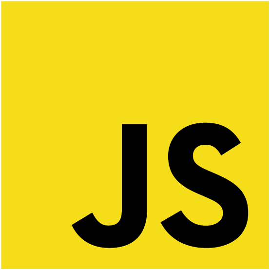
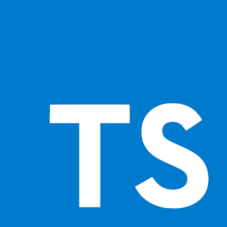
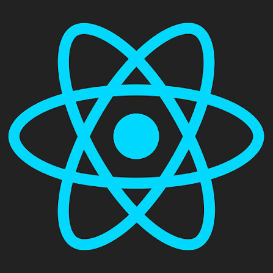
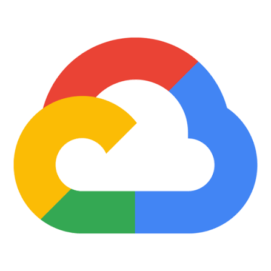
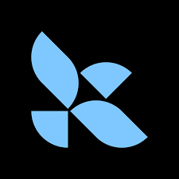
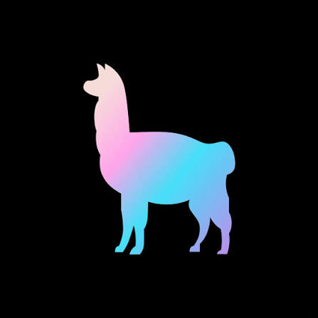
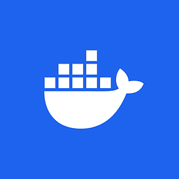
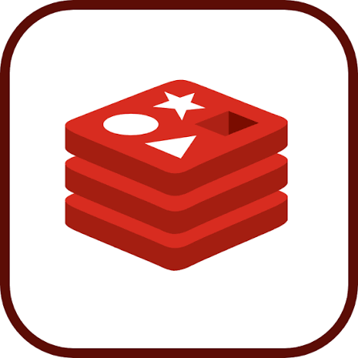

<h1 style="margin:0 0 8px;font-size:50px;font-weight:900;letter-spacing:1;background:linear-gradient(90deg,#FFE55C,#FFD700,#DAA520);-webkit-background-clip:text;-webkit-text-fill-color:transparent;filter:drop-shadow(0 0 8px rgba(255,215,0,0.3));">Erbaz Kamran</h1>

Senior Software Engineer | Agentic-AI Engineer | Team Lead

وہی جہاں ہے ترا جس کو تو کرے پیدایہ سنگ و خشت نہیں جو تیری نگاہ میں ہے

— "Your world is - in fact - that which you birth through your thoughts, not the stones and bricks that you see." — Allama Iqbal

<h2 style="color:gold"> 🚀 What I Do </h2>

🏗️ **Lead** — led teams to deliver with a product engineering mindset.
🤖 **AI-Driven Engineering** — I don't vibe-code. Rather I delve deep into technical design specs for each product feature, using coding agents to scale and speed up the development lifecycle, and improving on agent skills while maximizing context gathering efficiency.
🌍 **Travel** — love hiking, treking, and discovering historical landmarks.
📚 **Read and Philosophize** — fascinated by philosophy, logic, history, and high-fantasy novels.

<h2 style="color:gold">🏅 Certifications </h2>

<h2 style="color:gold">📫 Let's Connect</h2>

  
  
  

