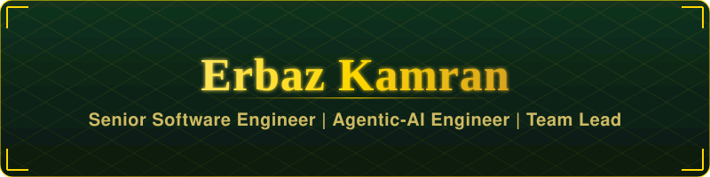
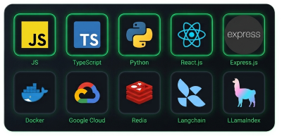

<h2 style="color:gold"> 🚀 What I Do </h2>

🏗️ **Lead** — led teams towards delivery with a product engineering mindset. \
🤖 **AI-Driven Engineering** — I don't vibe-code. Rather I delve deep into technical design specs for each product feature, using coding agents to scale and speed up the development lifecycle, and improving on agent skills while maximizing context gathering efficiency. \
🌍 **Travel** — love hiking, treking, and discovering historical landmarks. \
📚 **Read and Philosophize** — fascinated by philosophy, logic, history, and high-fantasy novels.

---

<h2 style="color:gold">🏅 Certifications </h2>

---

<h2>💻 Tech-Stack</h2>

  

---

<h2 style="color:gold">📫 Let's Connect</h2>

  
  
  

